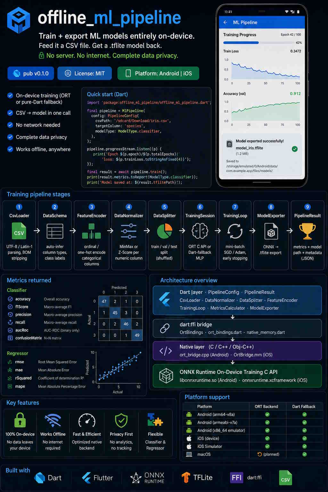

# offline_ml_pipeline

> **Train + export ML models entirely on-device.**  
> Feed it a CSV file. Get a `.tflite` model back.  
> No server. No internet. Complete data privacy.

[](https://pub.dev/packages/offline_ml_pipeline)
[](LICENSE)
[](https://flutter.dev)

---





## Why this package exists

Every ML package in the Flutter ecosystem today is **inference-only**: you bring
a pre-trained model and feed it data.  
`offline_ml_pipeline` breaks that limitation. It trains the model **on the
device itself** from raw CSV data, using ONNX Runtime's On-Device Training C API
accessed via `dart:ffi`.

| | Existing packages | offline_ml_pipeline |
|---|---|---|
| Inference | ✅ | ✅ |
| On-device training | ❌ | ✅ |
| CSV → model in one call | ❌ | ✅ |
| No network needed | ❌ | ✅ |
| Privacy (no data leaves device) | ❌ | ✅ |

---

## Quick start

```dart
import 'package:offline_ml_pipeline/offline_ml_pipeline.dart';

final pipeline = MlPipeline(
  config: PipelineConfig(
    csvPath: '/sdcard/Download/iris.csv',
    targetColumn: 'species',
    modelType: ModelType.classifier,
  ),
);

// Optional: stream live training progress
pipeline.progressStream.listen((p) {
  print('Epoch ${p.epoch}/${p.totalEpochs}  loss: ${p.trainLoss.toStringAsFixed(4)}');
});

// Train — runs in a background Isolate; UI stays smooth
final result = await pipeline.train();

print(result.metrics.toReport(ModelType.classifier));
print('Model saved at: ${result.tflitePath}');
```

---

## Installation

```yaml
# pubspec.yaml
dependencies:
  offline_ml_pipeline: ^0.1.0
```

```bash
flutter pub get
```

### Native libraries (required for ORT backend)

Run the downloader script **once** on your development machine:

```bash
chmod +x tool/download_ort_libs.sh
./tool/download_ort_libs.sh
```

This downloads the pre-built `libonnxruntime.so` (Android) and
`onnxruntime.xcframework` (iOS) into `native/` and `ios/Frameworks/`.

> **Pure-Dart fallback**: If the native library is absent (e.g. unit tests on CI),
> the package automatically falls back to a pure-Dart MLP trainer — no crash,
> no native dependency needed.

---

## Training pipeline stages

```
CSV file
  ↓  [1] CsvLoader          — UTF-8 / Latin-1 parsing, BOM stripping
  ↓  [2] DataSchema          — auto-infer column types, class labels
  ↓  [3] FeatureEncoder      — ordinal / one-hot encode categorical columns
  ↓  [4] DataNormalizer      — MinMax or Z-Score per numeric column
  ↓  [5] DataSplitter        — train / val / test split (shuffled)
  ↓  [6] TrainingSession     — ORT C API or Dart-fallback MLP
  ↓  [7] TrainingLoop        — mini-batch SGD / Adam, early stopping
  ↓  [8] ModelExporter       — ONNX → .tflite export
  ↓  [9] PipelineResult      — metrics + model path + metadata sidecar JSON
```

---

## Configuration

```dart
PipelineConfig(
  // ── Required ──────────────────────────────────────────
  csvPath:       '/path/to/data.csv',
  targetColumn:  'label',            // column to predict
  modelType:     ModelType.classifier, // or .regressor

  // ── Data ─────────────────────────────────────────────
  csvDelimiter:  ',',
  csvHasHeader:  true,
  trainRatio:    0.8,
  valRatio:      0.1,
  testRatio:     0.1,

  // ── Normalisation ─────────────────────────────────────
  normalizationStrategy: NormalizationStrategy.minMax, // or .zScore

  // ── Training ─────────────────────────────────────────
  epochs:        100,
  batchSize:     32,
  optimizerConfig: OptimizerConfig.adam(learningRate: 0.001),
  lossFunction:  LossFunction.crossEntropy,
  earlyStopping: EarlyStopping(patience: 10, minDelta: 0.0001),

  // ── Export ────────────────────────────────────────────
  quantizationMode: QuantizationMode.float16,
  embedPreprocessing: true,
)
```

### Factory presets

```dart
// Health / medical classification
PipelineConfig.healthClassifier(
  csvPath: '/path/to/patient_data.csv',
  targetColumn: 'diagnosis',
);

// Financial / time-series regression
PipelineConfig.financeRegressor(
  csvPath: '/path/to/prices.csv',
  targetColumn: 'close_price',
);
```

---

## Supported model architectures

| Architecture | Dart enum | Description |
|---|---|---|
| Logistic / Linear | `ModelArchitecture.linear` | Single dense layer — fastest |
| Shallow MLP | `ModelArchitecture.mlpShallow` | 1 hidden layer (64 units) — default |
| Deep MLP | `ModelArchitecture.mlpDeep` | 2 hidden layers (128 → 64) |

---

## Metrics returned

### Classifier
| Metric | Description |
|---|---|
| `accuracy` | Overall accuracy |
| `f1Score` | Macro-average F1 |
| `precision` | Macro-average precision |
| `recall` | Macro-average recall |
| `aucRoc` | AUC-ROC (binary only) |
| `confusionMatrix` | N×N matrix |

### Regressor
| Metric | Description |
|---|---|
| `rmse` | Root Mean Squared Error |
| `mae` | Mean Absolute Error |
| `rSquared` | Coefficient of determination R² |
| `mape` | Mean Absolute Percentage Error |

---

## Architecture overview

```
┌─────────────────────────────────────────────────────────────┐
│                        Dart layer                           │
│  MlPipeline → PipelineConfig → PipelineResult               │
│  CsvLoader · DataNormalizer · DataSplitter · FeatureEncoder │
│  TrainingLoop · MetricsCalculator · ModelExporter           │
├─────────────────────────────────────────────────────────────┤
│                     dart:ffi bridge                         │
│  OrtBindings → ort_bindings.dart → native_memory.dart       │
├─────────────────────────────────────────────────────────────┤
│            Native layer (C / C++ / Obj-C++)                 │
│  ort_bridge.cpp (Android) · OrtBridge.mm (iOS)              │
├─────────────────────────────────────────────────────────────┤
│         ONNX Runtime On-Device Training C API               │
│  libonnxruntime.so (Android) · onnxruntime.xcframework (iOS)│
└─────────────────────────────────────────────────────────────┘
```

---

## Generating ORT training artifacts

The ORT training backend requires four artifact files per model configuration:
`training_model.onnx`, `eval_model.onnx`, `optimizer_model.onnx`, `checkpoint`.

Generate them using the provided Python script (run once on a developer machine):

```bash
pip install onnxruntime-training torch onnx numpy

# Generate a full set of standard templates
python tool/generate_ort_artifacts.py --model_type all \
    --output assets/ort_training_templates

# Or generate a specific config
python tool/generate_ort_artifacts.py \
    --model_type classifier \
    --features 10 \
    --classes 4 \
    --output assets/ort_training_templates/classifier_10f_4c
```

---

## Running tests

```bash
# Unit tests (no native dependencies needed)
flutter test test/unit/

# Integration tests (runs Dart-fallback trainer)
flutter test test/integration/full_pipeline_test.dart
```

---

## Project structure

```
offline_ml_pipeline/
├── lib/
│   ├── offline_ml_pipeline.dart     ← barrel file (public API)
│   └── src/
│       ├── pipeline/                ← MlPipeline, PipelineConfig, PipelineResult
│       ├── data/                    ← CsvLoader, DataNormalizer, DataSplitter, FeatureEncoder
│       ├── models/                  ← ModelType, ModelSpec, NeuralModel, LinearModel, TreeModel
│       ├── training/                ← TrainingSession, TrainingLoop, Metrics, Optimizer
│       ├── export/                  ← ModelExporter, OnnxSerializer, TFLiteConverter
│       ├── ffi/                     ← OrtBindings, OrtTypes, NativeMemory
│       └── utils/                   ← IsolateRunner, ProgressNotifier, ErrorHandler
├── android/
│   ├── CMakeLists.txt               ← builds ort_bridge.cpp
│   └── src/main/cpp/
│       ├── ort_bridge.h / .cpp      ← C++ ↔ ORT bridge
│       └── jniLibs/                 ← pre-built libonnxruntime.so per ABI
├── ios/
│   ├── offline_ml_pipeline.podspec
│   └── Classes/
│       ├── OrtBridge.h / .mm        ← Objective-C++ ↔ ORT bridge
│       └── Frameworks/              ← onnxruntime.xcframework
├── test/
│   ├── unit/                        ← CsvLoader, DataNormalizer, Metrics tests
│   └── integration/                 ← full pipeline tests + iris.csv fixture
├── example/                         ← complete Flutter demo app
└── tool/
    ├── generate_ort_artifacts.py    ← generates ORT training artifacts
    └── download_ort_libs.sh         ← downloads pre-built native libraries
```

---

## Privacy & security

- All data processing occurs **on-device only**.
- No analytics, telemetry, or crash reporting.
- No network permissions required.
- Model files are stored in `getApplicationDocumentsDirectory()` by default
  (accessible only to the app).

---

## Platform support

| Platform | ORT Backend | Dart Fallback |
|---|---|---|
| Android (arm64-v8a) | ✅ | ✅ |
| Android (armeabi-v7a) | ✅ | ✅ |
| Android (x86_64 emulator) | ✅ | ✅ |
| iOS (device) | ✅ | ✅ |
| iOS Simulator | ✅ | ✅ |
| macOS | 🔄 (planned) | ✅ |

---

## License

MIT © 2026 offline_ml_pipeline contributors
